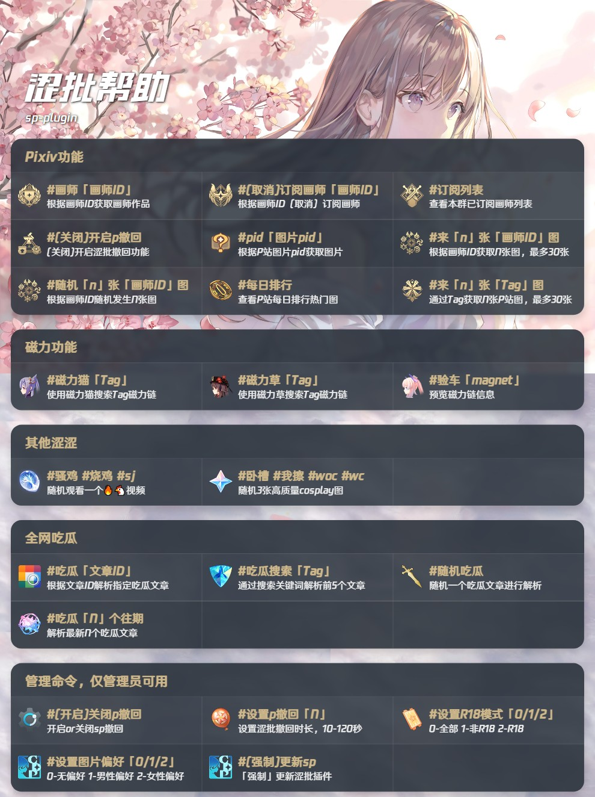

# 安装说明

## 安装

```bash
git clone https://ghfast.top/https://github.com/1638276310/sp-plugin.git ./plugins/sp-plugin/
```

## 安装依赖

```bash
pnpm add axios -w
```

为防止风控，所以安装python来处理图片

## 安装Python依赖

```text
pip install -i https://pypi.tuna.tsinghua.edu.cn/simple pillow
```

doker内安装（trss安装的崽）

```text
docker exec -it TRSS_AllBot /bin/bash
```

```text
pacman -S python-pillow
```

## 说明

- 本插件兼容Miao-yunzai/Trss-yunzai
- 兼容ICQQ、NCQQ

## 如果您对本插件有更好的代码建议，请提交Pull Requests

## Future

- 修复文章正文内容无法正确获取
- 增加更多插件

## ✨ 功能    欢迎加群991639461


